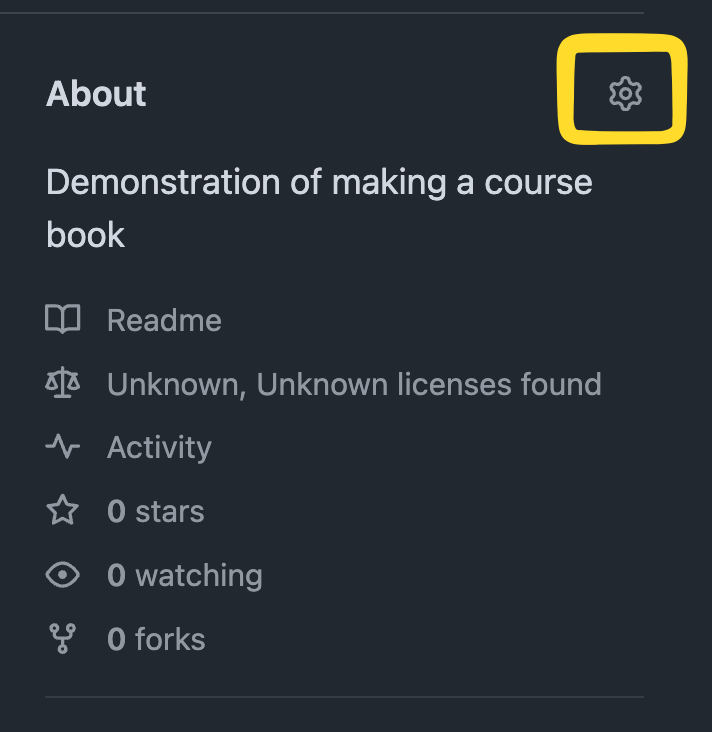
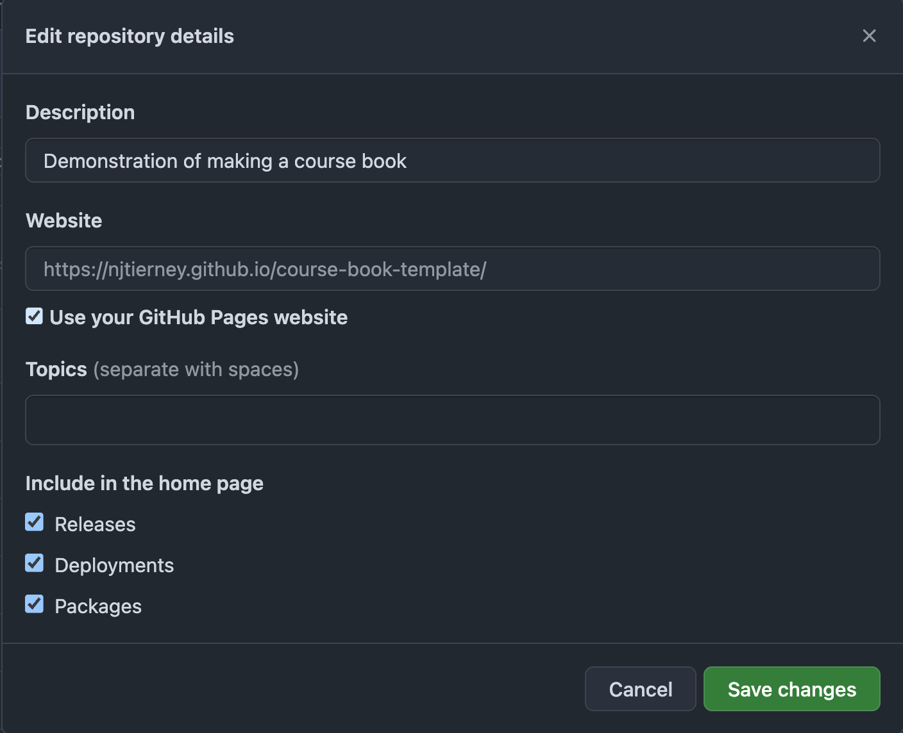

I recently gave a talk, [The value in teaching is not the **content** it's the **teacher**](https://njtierney.github.io/talk-teacher-over-content/#/title-slide)

My main point in this is:

> Your course materials should be out there in public for free online.

To help support this, this blog post goes through the technical details I note in one of my slides: How to Put your Course Book Online.

# Summary

- Make a quarto book
- Add an appropriate license [CC BY-NC-4.0](https://creativecommons.org/licenses/by-nc/4.0/)
  - Can share/adapt, must attribute
  - Cannot use materials commercially
- Add a README
- Put it on github
- Have it render as an online book when you make changes

# Follow along with github repo: "course-book-template"

I have made a repo on github ["course-book-template"](https://github.com/njtierney/course-book-template) that details each of these steps.

# Make a quarto book

The quarto docs on starting a book are *excellent* so I would recommend starting there: <https://quarto.org/docs/books/#quick-start>.

But essentially, you run:

``` bash
quarto create project book .
```

It will then guide you through creating a title, etc

[commit of adding the book](https://github.com/njtierney/course-book-template/commit/e2b1a6f3b0e8668ca4c068365124124c14630230)

# Add an appropriate license

It is important to pick a license early. This helps protect your work, and also makes it clear to others how to reference and use your work. Personally, I like [CC BY-NC-4.0](https://creativecommons.org/licenses/by-nc/4.0/), this gives you these conditions:

- Can share/adapt, must attribute
- Cannot use materials commercially

Note that this is different to the very common [CC-BY](https://creativecommons.org/licenses/by/4.0/), which does allow commercial usage.

If you aren't sure about licenses for your purpose, it would be worthwhile checking out the chooser here <https://creativecommons.org/chooser/>

In using this, I discovered another useful license, [CC-BY-NC-SA 4.0](https://creativecommons.org/licenses/by-nc-sa/4.0/) Which builds off of CC-BY-NC, but with one additional clause:

> ShareAlike - If you remix, transform, or build upon the material, you must distribute your contributions under the same license as the original.

This is sometimes known as "copyleft". This is sometimes seen as too restrictive. Consult with your community about what the standards are. Another useful place to read up on licenses is the ["licensing" chapter in the R packages book by Hadley Wickham and Jenny Bryan](https://r-pkgs.org/license.html)

I add a LICENSE file, and also a license.qmd chapter, as well as add the license to the README.

[commit of adding the license](https://github.com/njtierney/course-book-template/commit/1825258f3bda4116ef09886c4fda7dedd722c2f2)

# Using a README

I think it is worthwhile adding a few key sections to your README file:

- Details: like the abstract - the hook!
- Prerequisites: What do you expect learners to know?
- Learning outcomes: What will they walk away knowing?
- Schedule: An outline of each hour of learning, optionally with a timetable

[commit of adding the README](https://github.com/njtierney/course-book-template/commit/5ca6202b80b047f1da48486db57df96d2bbdbf02)

# Put it on online - github

Your course should live somewhere public! You can see for example our course materials here: <https://github.com/njtierney/course-book-template>

# Have it render when you make changes

You can use github actions to render your book. This is really neat, and means your book will be rendered anytime you push changes. It means you don't need to push HTML, just the quarto files.

Rhere are a few different ways you can manage this, I happen to like using github pages.

There are some really nice instructions on the quarto website on how to set up github pages - <https://quarto.org/docs/publishing/github-pages.html#github-action>

However, I have found a slightly different setup, which I will share here.

This involves using a DESCRIPTION file to track the R packages that you use. The reason we need to do this is to make sure when we render our book, that all the R packages we need are installed. There are probably other ways around this, and I'd love to hear them, but this is what I have found works.

Here is the first step where I add a dependency, in this case, tidyverse.

[commit of adding this tidyverse code](https://github.com/njtierney/course-book-template/commit/7777757f9ab2d98985576ef7e65ebc801e2ae17e)

Then add the DESCRIPTION file with:

``` r
usethis::use_description(check_name = FALSE)
```

I then edited mine to look like this:

``` dcf
Package: course-book-template
Title: A book about some things
Version: 0.0.0.9000
Authors@R: 
  c(
  person(
    given = "Nicholas",
    family = "Tierney",
    email = "nicholas.tierney@gmail.com",
    role = c("aut", "cre"),
    comment = c(ORCID = "https://orcid.org/0000-0003-1460-8722")
    )
  )
Description: Course materials for your topic. This should have two sentences.
License: CC-BY-NC 4.0 + file LICENSE
Encoding: UTF-8
Language: en-GB
Roxygen: list(markdown = TRUE)
RoxygenNote: 8.0.0
```

[commit](https://github.com/njtierney/course-book-template/commit/22ec04320474b5c60d6ab1e51772e2a30cfc899d)

You can then add your package dependency into Imports or Depends. Which one you use is normally very important for R package development, but the reason we are using a DESCRIPTION file here is to track our dependencies.

<div class="highlight">

<pre class='chroma'><code class='language-r' data-lang='r'><span><span class='nf'>usethis</span><span class='nf'>::</span><span class='nf'><a href='https://usethis.r-lib.org/reference/use_package.html'>use_package</a></span><span class='o'>(</span><span class='s'>"tidyverse"</span>, type <span class='o'>=</span> <span class='s'>"Depends"</span><span class='o'>)</span></span></code></pre>

</div>

[commit](https://github.com/njtierney/course-book-template/commit/ec736d9eb84849cc10ab798f57772694d33766d0)

I then add the github actions - you can actually just refer to a file, so this will work:

``` r
use_github_action(url = "https://github.com/njtierney/gentlegit/blob/main/.github/workflows/quarto-publish.yml")
```

This will give you a message like the following:

    ✔ Creating .github/.
    ✔ Adding "^\\.github$" to .Rbuildignore.
    ✔ Adding "*.html" to .github/.gitignore.
    ✔ Creating .github/workflows/.
    ✔ Saving
      "njtierney/gentlegit/.github/workflows/quarto-publish.yml@main"
      to .github/workflows/quarto-publish.yml.

[commit](https://github.com/njtierney/course-book-template/commit/0d18aaa8546698cb2c5ec8de38f5b5ee60be3dbf)

Also, probably a good time to add a .gitignore file. This is a good idea to make sure you don't commit HTML files (they can be really large,a nd we don't need them), or other file types that might be really large, or have sensitive information in them.

<div class="highlight">

<pre class='chroma'><code class='language-r' data-lang='r'><span><span class='nf'>usethis</span><span class='nf'>::</span><span class='nf'><a href='https://usethis.r-lib.org/reference/use_git_ignore.html'>use_git_ignore</a></span><span class='o'>(</span><span class='s'>"*.pdf"</span><span class='o'>)</span></span></code></pre>

</div>

Will create the file, and tell git to never commit a PDF.

I edit my .gitignore file to look like the following:

    /.quarto/
    **/*.quarto_ipynb
    .Rproj.user
    .Rhistory
    .RData
    .Ruserdata
    dev
    docs
    /.quarto/
    *.aux
    *.log
    *.pdf
    *.tex
    *.toc
    *.rds
    *_files
    *_cache
    *.html
    .DS_Store

[commit](https://github.com/njtierney/course-book-template/commit/9c165f3c88194b7a2526fe13cfbaaa5ea6c89d9a)

Once all this is said and done, you will still need to run some commands in your terminal:

``` bash
quarto publish gh-pages
```

This should then produce a question like:

    nick course-book-template[main] > quarto publish gh-pages
    ? Publish site to https://njtierney.github.io/course-book-template/ using gh-pages? (Y/n) › 

reply "Y"

You will then get some code that looks like:

    Switched to a new branch 'gh-pages'
    [gh-pages (root-commit) 8ccc5e0] Initializing gh-pages branch
    remote: 
    remote: Create a pull request for 'gh-pages' on GitHub by visiting:        
    remote:      https://github.com/njtierney/course-book-template/pull/new/gh-pages        
    remote: 
    To https://github.com/njtierney/course-book-template.git
     * [new branch]      HEAD -> gh-pages
    Switched to branch 'main'
    Your branch is up to date with 'origin/main'.
    From https://github.com/njtierney/course-book-template
     * branch            gh-pages   -> FETCH_HEAD

And then some rendering code that will look like:

    Rendering for publish:

    [1/4] index.qmd
    [2/4] intro.qmd


    processing file: intro.qmd
    1/3                  
    2/3 [unnamed-chunk-1]
    3/3                  
    output file: intro.knit.md

    ...

    (|) Deploying gh-pages branch to website (this may take a few minutes)

Wait a few minutes, as it asks you.

Then you should see something like:

    [✓] Deploying gh-pages branch to website (this may take a few minutes)
    [✓] Published to https://njtierney.github.io/course-book-template/

    NOTE: GitHub Pages deployments normally take a few minutes (your site updates
    will be visible once the deploy completes)

Your website probably won't be visible just yet, which feels a touch annoying, but you can keep an eye on it on the "actions" tab, e.g., <https://github.com/njtierney/course-book-template/actions>

Once this has lit green (hopefully it has!)

You should go to your "about" section, and click on the setting cog:

<div class="highlight">



</div>

Then tick the box that says "Use your GitHub Pages website"

<div class="highlight">



</div>

This adds your GitHub Pages website onto the repo, and it looks pretty neat.

There are more things you can do, like configuring your own custom website instead of using github.

So, instead of <https://njtierney.github.io/course-book-template/>, you could have: "course-book-template.com".

And that's it!

